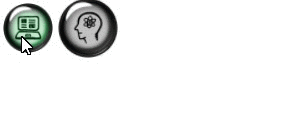

GLASS BUTTONS
---------------

These are translucent glass round buttons with any background image.



## Install
To install, you need to download the `GlassButton_ES5.js` file and include it on the html page
```
<script src="GlassButton_ES5.js"></script>
```

## Getting Started
``` js
	var But1 = new GlassButton('Button1','1.png', function() {console.log('Test-1')});
	But1.OnClickFunction = function() {
		if (But2.scale) {But2.scale=false} else {But2.scale=true};
		But2.X++;
		But2.Y++;
		But2.Size++;
	}
	But1.add(5,5,50);
	var But2 = new GlassButton('Button2','1.png',function() {this.scale = true;console.log('Test-3');But1.drop();});
	But2.add(65,5,50);
	But2.scale = true;
	But2.SetImage ('2.png');
```