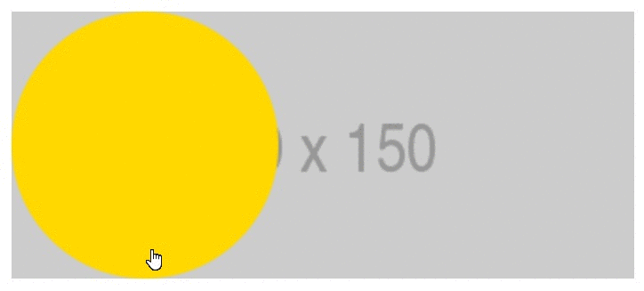
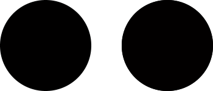

MAP MASK
---------------
This module allows you to use a hidden graphic image as a template for pointing and selecting complex geometric shapes.



## Install
To install, you need to download the `MapMask.js` file and include it on the html page
```
<script src="MapMask.js"></script>
```

## Getting Started

**Let it be necessary to activate two circles on the original background.**

First, let's load the mask image. Each zone on the mask should be marked with its own color. In our case, we use two zones with color codes 1 and 2.
>Mask image example:
>

After that, bring it into line with the size of the main image area.
```
window.MapMask.ReSize(700, 300);
```

And bind two functions
```
window.MapMask.OnChangeColor = function(NewColor,OldColor) {...}
```
when the color changes while moving inside the mask, and
```
window.MapMask.OnLeaveMask = function() {...}
```
when leaving the mask area.

To connect the main image area and the mask, we create two handlers
```
onmousemove = "window.MapMask.OnMouseMove(this,event)"
onmouseleave = "window.MapMask.OnMouseLeave(this,event)"
```